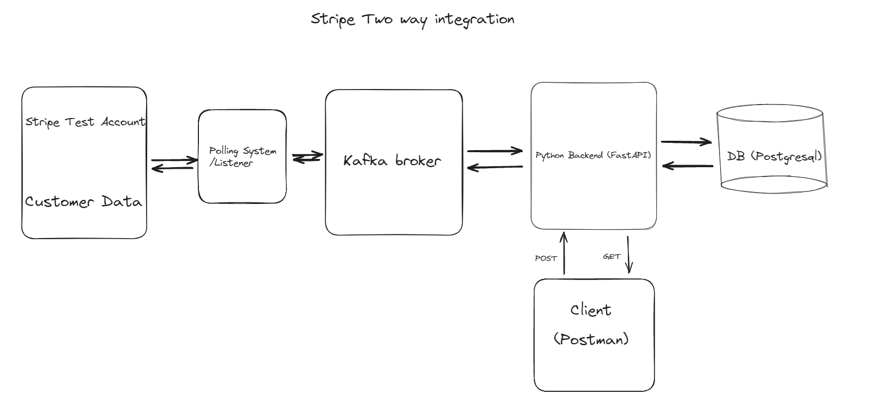

# Stripe Two Way Integration

The objective of this project is to simulate a product that has a simple
customer catalog (think of it as a simple customer table) and build a two-way integration with a
customer catalog in an external service - Stripe in this case. The two-way sync is supposed to be near
real-time so that a customer added/edited on one system propagates to the other system within
a few seconds. The goal is to build this in a way such that you can add other integrations with
the customer catalog, and other integrations with other catalogs (like, say, an invoice catalog) in
the future.

## Initial architecture



## Run Locally

To deploy this project on local system follow following steps

Clone the project

```bash
  git clone https://github.com/D3N2-A/Stripe_integration.git
```

Create local env and activate it

```bash
  python -m venv .venv
```

- For Windows

```bash
  .venv\Scripts\activate
```

- For Mac/Unix

```bash
  source .venv/bin/activate
```

Install Dependencies

```bash
  pip install -r requirements.txt
```

Run Docker to start kafka broker

```bash
 cd docker
 docker compose up -d
```

## Kafka Usage

In this Project kafka is setup in such a way that we can incorporate different integration in future if needed such as salesforce customer catalog. We can create a topic which is subscribed by consumer and that is polled at a interval. Producer can publish message to any topic. For scaling, we can partition a topic or we can create a kafka cluster each one catering to different integration.

## API Usage

#### Get all customers

```http
  GET /customers
```

| Parameter | Type | Description |
| :-------- | :--- | :---------- |
| `None`    | ``   |             |

#### Get customer

```http
  GET /customer/${id}
```

| Parameter | Type     | Description                  |
| :-------- | :------- | :--------------------------- |
| `id`      | `string` | **Required**. Id of customer |

#### Create customer

```http
  POST /customer
```

| Body Parameter | Type     | Description                     |
| :------------- | :------- | :------------------------------ |
| `name`         | `string` | **Required**. Name of customer  |
| `email`        | `string` | **Required**. Email of customer |

#### Update customer

```http
  Delete /customer
```

| Body Parameter | Type     | Description                     |
| :------------- | :------- | :------------------------------ |
| `id`           | `string` | **Required**. Id of customer    |
| `name`         | `string` | **Optional**. Name of customer  |
| `email`        | `string` | **Optional**. Email of customer |

#### Delete customer

```http
  Delete /customer
```

| Body Parameter | Type     | Description                     |
| :------------- | :------- | :------------------------------ |
| `id`           | `string` | **Required**. Email of customer |
